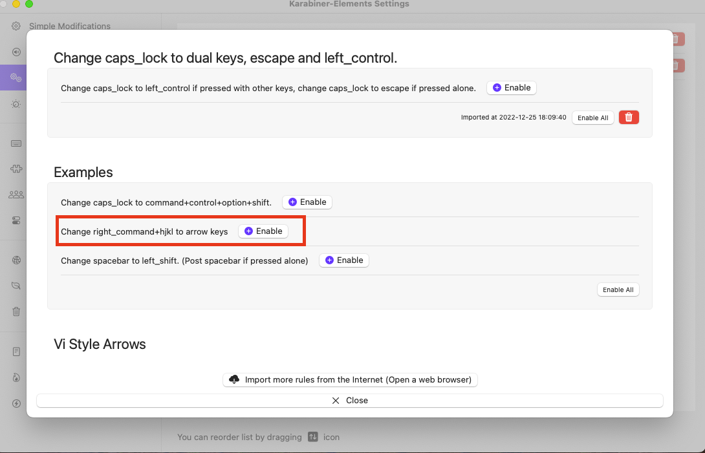

# Efficient Tools On Mac

## [Karabiner-Elements](https://karabiner-elements.pqrs.org/)

Karabiner-Elements is a keyboard customization tool for macOS. It allows users to remap keys, modify keyboard behavior, and customize shortcuts to tailor their keyboard experience. 

1. Change caps _lock to left _control if pressed with other keys, change caps lock to escape if pressed alone.

	[Asset URL](https://ke-complex-modifications.pqrs.org/#caps_lock_tapped_escape_held_left_control)

2. Change right _command+hjkl to arrow keys

	This asset is in the examples of Complex Modifications.

	

## copyclip

"CopyClip" is a software or app that allows users to manage and enhance their clipboard functionality on computers or mobile devices.

(Download from AppleStore.)


## [MonitorControl](https://github.com/MonitorControl/MonitorControl)

Controls your external display brightness and volume and shows native OSD.

## Others
- Telegram
- Nomachine
- Dropbox
- OBS

# Efficient Tools On Windows

## AutoHotKey

AutoHotKey is a free and open-source scripting language designed for automating various tasks on the Windows operating system. 


1. Change caps_lock to left_control if pressed with other keys, change caps lock to escape if pressed alone.

	URL: https://gist.github.com/sedm0784/4443120

2. Change right_alt+hjkl to arrow keys

        URL: https://www.autohotkey.com/boards/viewtopic.php?f=76&t=82285
        (anwsered by boiler)

Total file:
```
g_LastCtrlKeyDownTime := 0
g_AbortSendEsc := false
g_ControlRepeatDetected := false

*CapsLock::
    if (g_ControlRepeatDetected)
    {
        return
    }

    send,{Ctrl down}
    g_LastCtrlKeyDownTime := A_TickCount
    g_AbortSendEsc := false
    g_ControlRepeatDetected := true

    return

*CapsLock Up::
    send,{Ctrl up}
    g_ControlRepeatDetected := false
    if (g_AbortSendEsc)
    {
        return
    }
    current_time := A_TickCount
    time_elapsed := current_time - g_LastCtrlKeyDownTime
    if (time_elapsed <= 250)
    {
        SendInput {Esc}
    }
    return

~*^a::
~*^b::
~*^c::
~*^d::
~*^e::
~*^f::
~*^g::
~*^h::
~*^i::
~*^j::
~*^k::
~*^l::
~*^m::
~*^n::
~*^o::
~*^p::
~*^q::
~*^r::
~*^s::
~*^t::
~*^u::
~*^v::
~*^w::
~*^x::
~*^y::
~*^z::
~*^1::
~*^2::
~*^3::
~*^4::
~*^5::
~*^6::
~*^7::
~*^8::
~*^9::
~*^0::
~*^Space::
~*^Backspace::
~*^Delete::
~*^Insert::
~*^Home::
~*^End::
~*^PgUp::
~*^PgDn::
~*^Tab::
~*^Return::
~*^,::
~*^.::
~*^/::
~*^;::
~*^'::
~*^[::
~*^]::
~*^\::
~*^-::
~*^=::
~*^`::
~*^F1::
~*^F2::
~*^F3::
~*^F4::
~*^F5::
~*^F6::
~*^F7::
~*^F8::
~*^F9::
~*^F10::
~*^F11::
~*^F12::
    g_AbortSendEsc := true
    return

;About Alt + hjkl for arrow key, refer to: https://www.autohotkey.com/boards/viewtopic.php?f=76&t=82285 (anwsered by boiler)
*>!k::
	Mods := GetKeyState("Shift", "P") ? "+" : ""
	Mods .= GetKeyState("Ctrl", "P") ? "^" : ""
	Send, % Mods "{Up}"
return

*>!h::
	Mods := GetKeyState("Shift", "P") ? "+" : ""
	Mods .= GetKeyState("Ctrl", "P") ? "^" : ""
	Send, % Mods "{Left}"
return

*>!j::
	Mods := GetKeyState("Shift", "P") ? "+" : ""
	Mods .= GetKeyState("Ctrl", "P") ? "^" : ""
	Send, % Mods "{Down}"
return

*>!l::
	Mods := GetKeyState("Shift", "P") ? "+" : ""
	Mods .= GetKeyState("Ctrl", "P") ? "^" : ""
	Send, % Mods "{Right}"
return
```

Usage:
- Download `AutoHotKey`
- Create a *.ank file, and add above to a *.ank file
- Run this file with Admin

## [Monitorian](https://github.com/emoacht/Monitorian)
External Monitor Brightness Control

## Others

- CopyQ (Same as CopyClip on Mac)
- ShareX (Screen shot/record)
